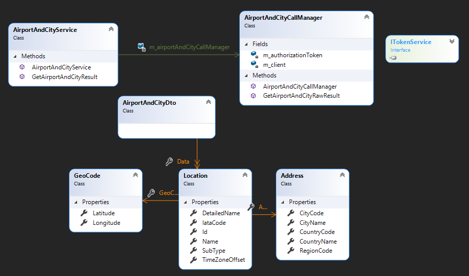
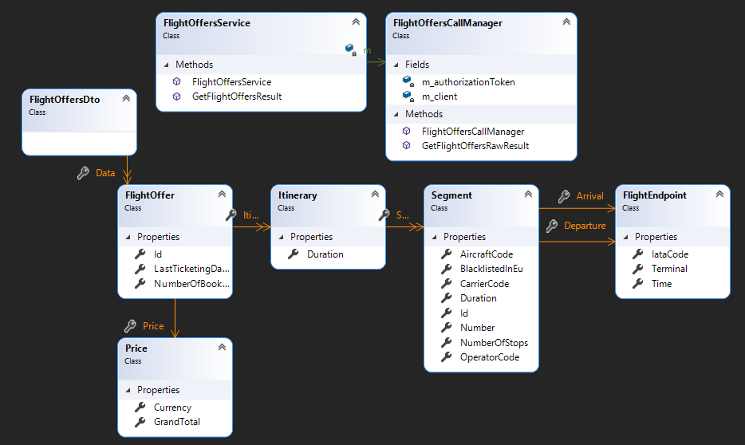
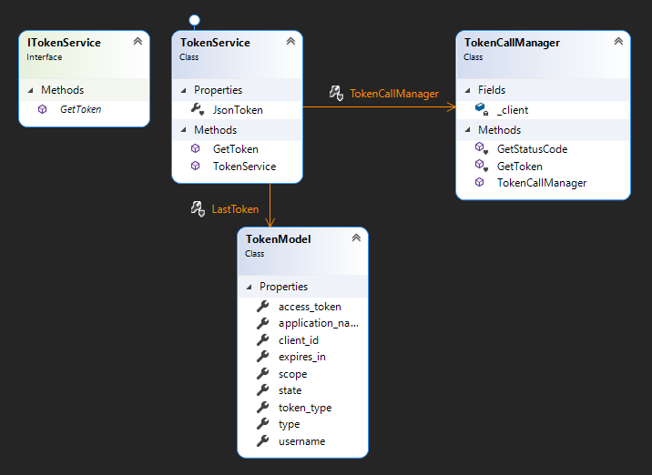

# RightFlightPlus
Air Travel Booking App using Flight API

## Project Definition of Done

- [x] Connect a web API to our C# project
- [x] Create and run tests for 80% of the API essential parts of the data structure
- [x] Ensure 100% of the tests pass.

## Class Diagrams:

### Airport And City Search API

### Flight Offers Search API

### 

### Token API

## Sprint 1

### Sprint Goals
* Select API in Postman
  * Obtain API token
* Setup Project Structure
* Conduct Test Analysis
* Design Data Models

### Sprint Review
* We chose and API: Amadeus: Airport and City Search
* We automated the process for getting a 30-minute access token
* We setup the project structure
* We created some preliminary tests for the token API
* We created some preliminary tests for the Airport and City Search API
* We designed the data models and implemented them in C#
* We created stubs in order to test the API
* We conducted a preliminary analysis of the test basis and created test conditions
* We created the code to access the Airport and City Search API.

### Sprint Retrospective

* Possibly spending too much time on documentation, and updating the Kanban board
* We faced some difficulties with merging work from different team members. This may have been due to improper use of branches and pull requests. In addition, changes were made to the project that were not saved when commits were made, leading to some confusion.

On the whole, the first sprint has been very productive.

## Sprint 2

### Sprint Goals
* Create and run tests for the Airport and City Search API
* Create and run tests for the Token Request API
* Research a new API
 * Create a data model for the new API.

### Sprint Review

* Created and passed tests for the Airport and City Search API
* Created and passed tests for the Token Request API
* Researched Flight Offers Search API
 * Created a data model for the new API
 * Wrote code to consume the Flight Offers Search API

### Sprint Retrospective

* We achieved the goals set out at the beginning of the sprint. Division of labour was going well; we are please with the project progress. The tests caught a variety of defects and developer errors which were easy to correct.

## Sprint 3

### Goals

* Tests for Flight offers search API
* Create additional tests for Token Request API
* Create additional tests for Airport and City Search API
* Add more Json Conversions
* Write test summary reports
* Class diagram for solution

### Review

* Create additional tests for Airport and City Search API
* Add more Json Conversions

Did not do:

* Tests for Flight offers search API
* Write test summary reports
* Class diagram for solution

### Retrospective

* Had issues with merge conflicts
* Readme was updated on Github and was not saved correctly; work deleted.
* Difficulties in communication led to incomplete sprint goals.

## Sprint 4

### Goals:

* Prepare for presentation
* Tests for Flight offers search API J
* Create additional tests for Token Request API F
* Class diagram for solution J
* Enable loading of test cases from external data source (Excel)

### Review

* Presentation planned and rehearsed
* Partial testing of Flight Offers API
* Class diagrams for APIs created
* External data source created and connected

### Retrospective

Use UML diagrams for class diagrams instead of Visual Studio class designers. This allows dependencies to be shown.

## Project Review:

* Connected and tested three APIs
* Created classes for the essential parts of the API data structure
* Created tests for approximately 80% of the implemented data structures
* All the tests created pass.

## Project Retrospective:

* Good communication, delegation of tasks, and co-operation.

* Kanban board worked well for the first two sprints, but we used the Readme to organise work. The team felt that time spent updating the Kanban board was not worth it, because the sprints were very short: half a day. In future, a Kanban board would be useful in a project with longer sprints.
* The team gained confidence in solving problems independently.
* We gained experience using Github in a collaborative project, submitting and reviewing pull requests and resolving merge conflicts.
* We became more familiar using APIs and associated software tools, and the ability to test them.

## Future Work:

* Finish Test cases for one of the APIs,
* Test the entire data structure of each API
* Integrate the API consumption project into a pre-existing WPF project that displays information about airports, and allows users to book flights.

## Instructions on How to Use the Testing Framework

* Download and build the project
* Navigate to the solution root folder.
* Here you will find an Excel spreadsheet called "AirportAndCityTestCases.xlsx"
    * This file contains the test inputs and expected outputs for testing the Aiport and City Search API. If the test inputs to be used or expected test results need to be changed, change the contents of this file to do this.
    * The cells marked "Location Type" and "Keyword" are the test inputs. Location Type can be either "Airport" or "City". Keyword can be any string.
    * The cell marked "Number of results" indicates the number of results expected to be returned by the API.
    * The table marked "Expected Results" are the results expected to be returned by the API for the given location type and keyword. Each row represents a single location result.
        * Index must start at 0 and increment by one on each row.
        * Subtype can be either "Airport" or "City".
        * Timezone Offset must be entered in the format "hh:mm" for a positive offset or "-hh:mm" for a negative offset. Do not use a plus sign for positive offsets.
    * **Do not move cells around**. Cell locations where the framework looks for data are hard-coded into the program, so moving cells from their original location will mean the framework will not be able to find the required data and will therefore fail.
    * **Do not change the format of cells (i.e. General/Number/Text/etc).** This will cause the program to interpret the data type of data stored in cells incorrectly. 
* To run the tests, do the following:
    * Make sure you have built the project.
    * Open command prompt.
    * Change directory to [solution-root]/ApiTestingProject/bin/Release
    * Run the executable file "ApiTestingProject.exe"
    * Test results will be displayed on-screen and also output to an xml file.
* Troubleshooting:
    * Make sure you have Microsoft Office 2013 or later installed.
    * If you encounter the following error: "*Unable to cast COM object of type 'System.\_\_ComObject' to interface type 'Microsoft.Office.Interop.Excel.Application'*" or similar, you may need to repair your installation of Microsoft Office. To do this, open your computer's Settings, click on Apps, find Microsoft Office, and then click "Modify". You will be given the option to do a Quick Repair. Do this, and then try to run the framework again.
